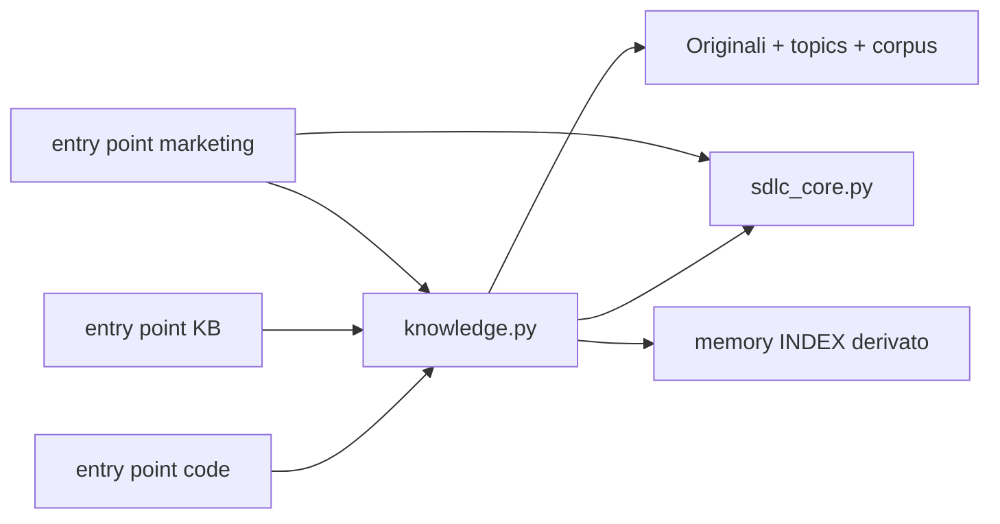

# Memoria comune, responsabilità distinte

## Objective
Ogni skill può ritrovare conoscenza, guide, decisioni e piani del progetto senza installare una sorella. La lente determina il metodo, non limita la conoscenza accessibile. Catalogo e collegamenti rinviano agli originali: non generano copie autorevoli né fatti certificati.

L'owner il 2026-09-19 ha esteso la precedente proposta opzionale code+KB a memoria comune anche marketing e autorizzato progettazione e implementazione. Pubblicazione/installazione globale escluse. Lavoro qui autorizzato, preservando F-056; ora separata nel commit cb6352c. F-057 prosegue su codex/f057-shared-project-memory.

## Feature Vision
Autorità: ai_docs/vision/project_vision.md, ai_docs/vision/rulings.md, ai_docs/vision/features/VISION_kb_second_brain.md. Avanza continuità, comprensione durevole e decisioni tracciabili. R11: consolidamento della macchina. R4: estensione esplicita dei benefici KB alle altre lenti. Distinzione da r10: una sola autorità di triage. Distinzione da r2/r3: consultazione dei documenti, mai selezione/assegnazione/ordinamento del lavoro.

Costo: recall mirato nell'orientamento e aggiornamento nel comando index già previsti; nessun artifact manuale o campo obbligatorio aggiunto. L1/E1 non richiede scansione/cattura rituale; una domanda fattuale sul progetto consulta comunque fonti pertinenti. Nessun servizio, rete, account, database o caricamento integrale del corpus per turno. Vision invariata.

## Admission and reading cost
r24 in ai_docs/vision/rulings.md registra la nuova estensione di scope (r4), non un'esenzione ereditata da r11. Base: richiesta owner di memoria comune del 2026-09-19 e conferma esplicita «Confermo il costo dichiarato» nello stesso giorno.

Byte UTF-8 normalizzati LF rispetto a cb6352c (F-056), non token e non somma caricata ogni turno:

| Lente | Delta SKILL.md, contratto caricato | Nuovo memory.md, su trigger | Delta routing.md, multi-lens | Delta ENFORCEMENT.md, setup/check |
|---|---:|---:|---:|---:|
| code | +462 | +5040 | +397 | -181 |
| knowledge | +359 | +5040 | +397 | -509 |
| marketing | +455 | +5040 | +397 | -179 |

Nessun campo manuale obbligatorio, nessuna scansione integrale per turno. Il catalogo è un artifact generato aggiunto da index; la sua verifica rilegge i documenti ammessi e calcola hash (I/O proporzionale ai byte documentali). Recall è mirato nei risultati ma scandisce quei metadati. La guida di comprensione è project-local, non aggiunta alla dottrina installata.

## Use Cases / User Needs
| ID | Bisogno | Beneficio |
|---|---|---|
| UC1 | Con la sola skill software trovare guide, piani e vincoli documentati | Continuità |
| UC2 | Collegare per argomento promessa marketing, piano e vincolo software | Visione orizzontale |
| UC3 | Ritrovare automaticamente una guida appena creata senza copiarla | Unica fonte |
| UC4 | Riaprire gli originali per valutarne stato ed evidenza | Accesso alle fonti; nessuna classificazione o certificazione automatica |
| UC5 | Rilevare claim/grafo/fonti invalidi da qualsiasi distribuzione | Integrità |
| UC6 | Conservare i controlli specialistici marketing e KB | Autonomia |

## Functional Spec
1. Memoria disponibile per default in ogni pacchetto. Assenza di topics non significa assenza di documentazione.
2. index genera memory/INDEX.md: percorso docs-relative, dominio dichiarato/default, argomenti opzionali, descrizione e impronta del contenuto. Non aggrega stati documentali (r2): per distinguere bozza/approvazione/comportamento si apre la singola fonte. Include cartelle documentali note dei tre domini, esclude sorgenti software, log, harness, indici derivati e corpus grezzo. Nessuna modifica a fonti/tassonomia.
3. recall QUERY [--root R] [--docs-dir D] cerca nei metadati correnti senza scrivere, indipendentemente dal catalogo salvato. Ricerca lessicale, non semantica: l'agente deve leggere le fonti prima di usarle.
4. topics: [onboarding, pricing] è metadato opzionale sui documenti, non crea topic/claim/gerarchie. Senza tag il documento rimane ricercabile per percorso/descrizione.
5. Comandi KB disponibili in ogni entry point. check aggiunge integrità KB ai controlli del proprietario; marketing conserva ledger/budget/funnel/trace. Software non promette controllo numerico marketing completo.
6. validate rileva catalogo obsoleto se presente; vecchi progetti senza catalogo non diventano invalidi per il solo upgrade. orient indica memoria/topic router. Senza tooling, documenti leggibili e limiti dichiarati.
7. Nessuna promozione automatica di stato/provenienza/approvazione. EV marketing resta autorevole per i numeri. Hybrid: shadow/versione consultabile non sostituisce DB; dati solo DB non scoperti dalla scansione locale.

## Interface Contract
Richiesta → owner e sola scala pertinente → recall mirato → fonti verificate → workflow owner → originali aggiornati → index → check owner + memoria. La consultazione non apre un secondo workflow.

index registra deterministicamente: non è un watcher. check/validate/recall sono read-only. Root ambigue rifiutate dal core; niente aggregazione silenziosa di ai_docs e mkt_docs. Lo stato si verifica nell'originale: se manca, non si inferisce; se dichiarato, non certifica conformità software.

## Capability Ledger
Stato rilevato prima dell'implementazione, non inventario del prodotto finale.
Orientamento: README/INDEX/architecture e guide router letti, router: no match. devPNT punta a chatPNT: Standalone, nessuna enumerazione semantica affidabile per questo repository.
| Capacità | Stato | Proprietario |
|---|---|---|
| Routing e autorità | EXISTS | routing.md / sdlc_core.py |
| Topic, claim, corpus, freshness | EXISTS | KB sdlc_check.py |
| Controlli numerici marketing | EXISTS | mkt_check.py |
| Memoria disponibile ovunque | INADEQUATE | entry point code inoltra solo al core |
| Catalogo trasversale degli originali | NEW | knowledge.py condiviso |

## Impact / Technical Design
Estrarre la macchina KB in scripts/knowledge.py byte-identico nelle tre distribuzioni. Il modulo non imposta profilo/dominio durante import; gli entry point mantengono identità/profilo. Si evita triplicazione e dipendenza da una seconda installazione. Alternativa scartata: invocare skill KB separata per ogni lavoro, duplica workflow e lascia green parziali.

### Module Change Plan
Directory concrete: C=skills/agentic-sdlc-skill; K=distributions/kb-agentic-skill/skills/kb-agentic-skill; M=distributions/mkt-agentic-sdlc/skills/mkt-agentic-sdlc. C/K/M espande a tutti e tre i path, non un campione.
| Path | Change, firme, integrazione, motivo |
|---|---|
| C/K/M scripts/knowledge.py | ADD: estrazione funzioni kb_* e main(argv=None) senza profilo. Nuove memory_records(docs), memory_build_index(docs), memory_index(docs), memory_validate(docs), memory_recall(docs, query), kb_refresh_indexes(docs), kb_validate_surface(docs, full=False). Catalogo confinato alla radice, no inferenza semantica |
| C/K scripts/sdlc_check.py | MODIFY main(argv=None): delega knowledge; K mantiene re-export API KB per compatibilità |
| M scripts/mkt_check.py | MODIFY main(argv=None): inoltra non-marketing a knowledge; cmd_index(root) aggiunge indici comuni; validate/check aggregano memoria senza perdere controlli marketing |
| C/K/M scripts/test_project_memory.py | ADD: CLI reale su fixture temporanee, stati, ricerca, idempotenza, freshness, grafi invalidi, root e link |
| C/K/M scripts/shared_files.py, scripts/shared_manifest.json | MODIFY/GENERATE: modulo, dottrina e test condivisi |
| C/K/M memory.md | ADD: recall/capture comuni, schema, autorità e limiti |
| C/K/M SKILL.md, ENFORCEMENT.md | MODIFY: memoria default, orientamento/chiusura e bundle a tre file |
| C/K/M routing.md | MODIFY: owner distinto da memoria; scala definitiva dell'owner, L1 invariato |
| package.json, distributions/kb-agentic-skill/package.json, distributions/mkt-agentic-sdlc/package.json | MODIFY: spedire knowledge.py e memory.md |
| scripts/init.js, distributions/kb-agentic-skill/scripts/init.js, distributions/mkt-agentic-sdlc/scripts/init.js | MODIFY: nota multi-lens non impone fusione delle scale; index esistente genera memoria |
| README.md, distributions/kb-agentic-skill/README.md, distributions/mkt-agentic-sdlc/README.md | MODIFY: memoria default, esempio, limiti |
| CHANGELOG.md, distributions/kb-agentic-skill/CHANGELOG.md, distributions/mkt-agentic-sdlc/CHANGELOG.md | MODIFY: novità |
| ai_docs/strategic/skill_family_agent_workflows.md | MODIFY: distinguere memoria e metodo |
| ai_docs/strategic/architecture.md, ai_docs/README.md | MODIFY: mappa dei componenti condivisi e accesso mirato alla memoria |
| ai_docs/architecture/ADR_2026-09-19_shared_project_memory.md | ADD: scelta e tradeoff |
| ai_docs/reference/GUIDE_shared_project_memory.md, ai_docs/reference/.sources/shared-project-memory-09bc631b.md | ADD: guida di comprensione e snapshot verbatim dei simboli; nessuna guida CURRENT preesistente copre il flusso multi-modulo |
| ai_docs/vision/rulings.md, ai_docs/strategic/existing_features.md | MODIFY: ammissione r24 con costo accettato e catalogo della capacità |
| ai_docs/audit/audit_plan.md | MODIFY via mark dopo riesame: riferimenti delle aree impattate, nessuna marcatura prima dell'allineamento dei derivati |

Blast radius: entry point CLI; batterie KB claim_ledger/kb_graph/kb_recall/kb_capture/kb_time_cycle/kb_revision che importano API; entry_point.load delle batterie shared; init.js invoca index; hook orient/remind; packaging npm. Ricerca locale rg: nessuna pretesa di completezza semantica. Firma KB invariata; wrapper re-export conserva compatibilità, test che patchano globals vanno verificati. Core diretto rimane base, non validator integrato. Se manca knowledge.py l'import fallisce: smoke packaging necessario.
Dati a riposo: schema claim/fonti e protezioni invariati, nessuna migrazione/backfill claim. Primo index catalogherà originali esistenti. Nessuna nuova macchina a stati e nessuno stato aggregato o modificato dall'indice.
Adeguare golden/test esistenti solo per delta effettivo della nuova interfaccia, registrando i path nel Diary; mai indebolire controlli per ottenere green.

## Security and Threat Model
| Rischio | Controllo |
|---|---|
| Istruzioni ostili nei documenti | Fonti trattate come dati, nessuna autorizzazione dall'indice |
| Link/symlink fuori root | Catalogazione confinata; output symlink rifiutato |
| Copia dati sensibili | Escludere corpus given, codice e log; catalogo espone solo metadati nello scope |
| Eco o promozione bozze | Zero claim o stati generati dal catalogo; riaprire fonti |
| Perdita controlli marketing | Composizione additiva e regressioni numeriche |
| Indice vecchio o fonte cancellata | Impronta e confronto deterministico, recall live, rigenerazione |
| Confusione fra progetti | Root core, ambiguità esplicita, nessuna ricerca globale |

## Action Plan
1. Review indipendente del progetto aggiornato, risolvere finding.
2. Test CLI red; estrazione KB e catalogo/recall.
3. Collegare entry point/packaging/dottrina, preservando F-056.
4. Eseguire regressioni e smoke pacchetti, aggiornare manifest/indici.
5. Review indipendente implementazione, ADR e chiusura con limiti verificati.

## Test Strategy
- Guide/ADR/piano marketing sullo stesso tema: tre riferimenti, domini conservati, zero claim creati. Stati rimangono nelle fonti, non aggregati nel catalogo/recall.
- index idempotente; modifica/cancellazione fonte rende catalogo stale; recall live senza scritture.
- Grafo ciclico fallisce da tutte le distribuzioni; ledger marketing invalido continua a fallire.
- Pacchetto singolo include terzo modulo e comandi senza sorelle.
- Root personalizzata/ambigua e symlink fuori root/output symlink.
- unittest tre distribuzioni; test_clients.js tre; drift; probe precedente come evidenza del vecchio comportamento.
- Scenario agente fresco: feature onboarding con promessa marketing DRAFT e ADR approvato, entrambi consultati senza inventare mandato o implementazione.

## Current State
Implementata; design, implementazione e riesame documentale finale PASS sul branch codex/f057-shared-project-memory. R24 e costo di lettura accettati; UC4 qualificato come accesso alle fonti. Commit della feature separato da F-056; nessun publish, install globale, bump o tag in questa unità. La release resta dell'owner e richiede i passi di GUIDE_release.md, non il solo lancio di publish_all.bat sulle versioni invariate.

## Diary
- 2026-09-19, progettazione iniziale: proposta opzionale code+KB PASS dopo due WARN; probe P1/P2/P3 green e negative control rosso. Nessuna implementazione allora.
- 2026-09-19, cambio di scope owner: memoria comune anche marketing, lavoro qui preservando F-056. Nuovo design, senza ereditare il PASS precedente. Gate iniziale NOT CLEAN per audit stale.
- 2026-09-19, design revisionato: PASS indipendente dopo BLOCK r2 (rimossa aggregazione stati) e WARN su allowlist e test estratto. Directory ammesse esplicite; K scripts/test_kb_capture.py indicato. Test memoria iniziali: 5 FAIL per capacità assente, 1 SKIP per symlink Windows.
- 2026-09-19, implementazione: motore KB estratto nei tre pacchetti con formati invariati; catalogo/recall, composizione entry point, packaging e dottrina. Delta test: C/K test_golden_regression.py, K test_kb_capture.py, tre test_clients.js, tre golden (+3/+3/+1 sole righe orient/index). Shared drift: 22 file identici. Probe P1/P2/P3 green.
- 2026-09-19, review implementazione R1 FAIL: due BLOCK (resolver marketing e write_text(newline) incompatibile Python 3.8/3.9), un WARN help marketing. Corretti con resolver comune, test root RED→GREEN, Path.open e help esplicito. Python 3.8/3.9 non eseguiti direttamente. Primo tentativo R2 interrotto da quota; self-pass dichiarato, nessun PASS indipendente attribuito a quel tentativo.
- 2026-09-19, verifica: suite Python code 221 (1 skip), KB 407 (15 skip), marketing 239 (14 skip), tutte OK; skip includono casi non applicabili e symlink senza privilegi. Acceptance fresco: recall, lettura originali, nessuna promozione DRAFT, guida indicizzata e nessuno sweep su refuso L1. Installer KB 50/50, marketing 50/50, pacchetto code 53/53; checkout code due crash ancora non diagnosticati a quel punto.
- 2026-09-19, R2 ripreso: final_memory_rereview, contesto fresco/read-only, PASS sulle tre correzioni e conformità ADR; nessun nuovo blocker. Review statica, non certificazione runtime Python 3.8/3.9. Log conserva FAIL→PASS. Architettura, reading guide, handoff e indici aggiornati; gate ancora stale.
- 2026-09-19, review esterna: confermata omissione r24 e costo di lettura, precisato UC4, cronologia riordinata. Rilievo sulla R2 superato dall'effettivo riesame indipendente. Owner autorizza commit F-056 isolato (cb6352c), poi completamento e commit F-057 senza publish. Branch dedicato creato; costo byte misurato e accettato esplicitamente.
- 2026-09-19, diagnosi installer: Node v24.14.0 fs.cpSync senza filtro sulla sola scripts/.pytest_cache locale termina 0xC0000409 nel sandbox; readdir e cpSync con filtro neutro espongono EPERM/opendir sulla stessa directory. copyRecursive identico a main; non è una prova che il crash accada su ogni checkout main. Stessa suite completa nel checkout fuori sandbox, home temporanee: 53/53 PASS. Nessuna modifica al copier, nessuna rimozione cache o alterazione ACL. Limite ambientale identificato, non etichettato come regressione F-057 né come difetto storico dimostrato su main.
- 2026-09-19, documentazione finale: guida code-source e snapshot (310 righe) per il flusso multi-modulo; README corretti anche nei vecchi passaggi a due file e Runtime Shape, non solo con un paragrafo aggiunto. Documento di famiglia allineato sui comandi condivisi e sulla non-equivalenza dei controlli numerici marketing.
- 2026-09-19, R3 circoscritto: PASS sulle correzioni documentali, r24/costi ricalcolati e guida-vs-snapshot (18 estratti byte-equivalenti). WARN non bloccante sulla parola «strutturali» nei derivati corretto distinguendo run_validate marketing dal check core; verifica autore, nessun quarto round oltre il cap. Review non sostituisce prove runtime.
- 2026-09-19, verifica finale autore: Python 221/407/239 OK (skip 1/15/14); installer code 53/53 fuori sandbox, KB e marketing verificati separatamente; pack dry-run tre pacchetti include memory.md/knowledge.py ed esclude test, cache, evals e snapshot. Nessuna nuova modifica runtime durante questa chiusura.
- 2026-09-19, riesame audit: delta skills/distributions dalle basi registrate include F-054 (forma recall multiramo), F-055 (licenza/NOTICE/manifest e invarianti), F-056 (fail-closed stale) e F-057; fonti, review registrate, packaging e batterie ricontrollati. scripts/: riesaminati seeder create-only, roster, copia, hook orient/remind, opt-out e rimozione attribuita; test installer sulle tre distribuzioni. ai_docs/: riletti Vision/rulings, ADR F-057, mappa componenti e derivati, registro review e guida/snapshot; indici e riferimenti verificati dal gate. mark chiude questo riesame, non sostituisce l'analisi; examples resta PENDING e la fixture sdlc-test-project resta SKIPPED.
