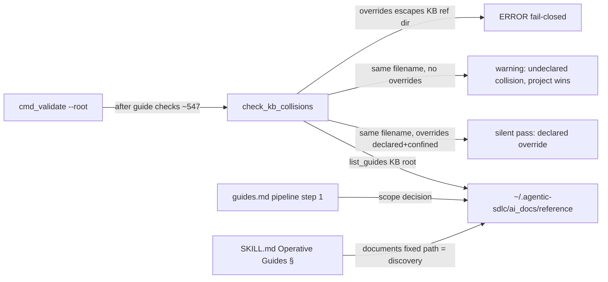

<!-- SHADOW generated from devPNT (e_tdd_agent_kb_u2 v1.0) - do not edit by hand -->
# E-TDD: Agent-Global Knowledge Base (Feature B unit 2) — Technical Design

**Implements:** `e_isp_agent_kb_u2` v1.0 (M-VISION operative_guides v1.2; P-TM T5 + T6-extension).

## 1. Integration & Data Flow

KB root is engine-identical to a project root: index/stale/validate run on it via the EXISTING `--root` (zero new code on that path).

## 2. Module Change Plan

### 2.1 skills/agentic-sdlc-skill/scripts/sdlc_check.py — MODIFY
(a) Constants (~line 52, near GUIDE_*):
```python
# Agent-global KB (Feature B unit 2): ONE client-agnostic root under home.
# AGENTIC_SDLC_KB_ROOT env var is a TEST/CI seam only (scenario battery must
# not touch the real user KB); the documented product path is fixed.
DEFAULT_KB_ROOT = Path(os.environ.get("AGENTIC_SDLC_KB_ROOT", "")) if os.environ.get("AGENTIC_SDLC_KB_ROOT") else Path.home() / ".agentic-sdlc"
```
(b) New function `check_kb_collisions(root, project_guides, errors, warnings)` placed after `list_guides` (~388). Appends to the two lists, returns None:
```python
def check_kb_collisions(root, project_guides, errors, warnings):
    """Cross-root awareness (unit 2): project-wins precedence, declared via 'overrides:'."""
    kb_root = DEFAULT_KB_ROOT
    kb_ref = (kb_root / "ai_docs" / "reference")
    try:
        if root.resolve() == kb_root.resolve():
            return  # validating the KB itself: no self-comparison
    except OSError:
        return
    if not kb_ref.is_dir():
        return  # no KB on this machine: zero behavior change
    kb_names = {p.name for _, p, _, _ in list_guides(kb_root)}
    for rel, p, meta, _ in project_guides:
        ov = (meta.get("overrides") or "").strip()
        if ov:
            # T6: untrusted cross-root pointer — distilled_from parity, fail closed
            ovp = Path(ov)
            if ovp.is_absolute() or ".." in ovp.parts:
                errors.append(f"{rel}: overrides '{ov}' is absolute or contains '..' — rejected (fail closed)")
                continue
            try:
                target = (kb_ref / ov).resolve()
                target.relative_to(kb_ref.resolve())
            except (ValueError, OSError):
                errors.append(f"{rel}: overrides '{ov}' escapes the KB reference dir — rejected (fail closed)")
                continue
            if not target.is_file():
                warnings.append(f"{rel}: overrides target '{ov}' not found in KB ({kb_ref})")
        if p.name in kb_names and ov != p.name:
            warnings.append(f"{rel}: undeclared collision with KB guide '{p.name}' (project wins) — declare overrides: {p.name}")
```
(c) Call site in `cmd_validate`, immediately after the guide-checks loop and BEFORE router alignment (between ~547 and ~548): `check_kb_collisions(root, guides, errors, warnings)`. Declared-and-confined same-name override produces NO output (silent pass): validate output stays byte-identical for clean projects (regression battery). Semantics: `overrides:` value must EQUAL the colliding KB filename to declare THAT collision; an overrides naming a non-colliding KB guide is validated (confinement + existence) but suppresses nothing. `overrides:` is SINGULAR by design (frontmatter last-write-wins, parity with the singular `distilled_from` precedent): a guide cannot simultaneously override one KB guide AND self-declare a different same-name collision — in that rare case the undeclared-collision warning still fires and is the intended, honest signal; split the guide if both relationships are genuinely needed.
(d) No other function touched. `errors` → rc 1 always; `warnings` → rc 1 under --strict (existing machinery, line ~578).

### 2.2 skills/agentic-sdlc-skill/guides.md — MODIFY (3 touch points)
1. Step 0 (DRY search): one sentence — search BOTH routers: project `ai_docs/reference/INDEX.md` AND the agent KB router `~/.agentic-sdlc/ai_docs/reference/INDEX.md` (if present); one CURRENT guide per topic PER SCOPE; a project guide on a KB topic requires the explicit `overrides:` declaration.
2. Step 1 (decomposition): the SCOPE decision — each proposed guide declared project-scope (`ai_docs/reference/`) or agent-scope (`~/.agentic-sdlc/ai_docs/reference/`); agent-scope = the indication governs the agent across ALL projects (origin+purpose test unchanged; scope is a LOCATION decision by the user, never a content taxonomy); KB created lazily (mkdir with `.sources/`) on the first agent-scope guide. User confirms scope together with the decomposition.
3. Maintenance: one line — KB guides use the same pipeline and validator via `--root ~/.agentic-sdlc`; freshness via the same `stale` engine.
Budget: +9/-0 lines (file 153→~162).

### 2.3 skills/agentic-sdlc-skill/SKILL.md — MODIFY (1 touch point)
"Operative Guides" section (~line 240): ONE paragraph appended (≤7 lines):
"**Agent-global KB.** A second, cross-project guide root lives at the fixed path `~/.agentic-sdlc/` (same `ai_docs/` structure, same validator/router/freshness engine via `sdlc_check.py --root ~/.agentic-sdlc`). Project guides win on topic collision; a project guide that overrides a KB guide MUST declare `overrides: GUIDE_<topic>.md` — the validator warns on undeclared collisions (error under `--strict`) and fail-closes on an `overrides:` value that escapes the KB. Discovery is this paragraph: agents and subagents reach KB guides by path, exactly like project guides."
MUST is load-bearing (undeclared precedence is the ambiguity T5 prevents); the why is the stated mechanism.

### 2.4 skills/agentic-sdlc-skill/templates.md — MODIFY (1 line)
Inside the existing GUIDE template fenced block, after the `source_hash:` line:
`overrides: GUIDE_topic.md   # optional — only for a project guide overriding an agent-KB guide`
No new ## heading, no new fence → lib.js needles unchanged.

### 2.5 README.md — MODIFY (1 touch point)
Guides feature bullet gains: "; an agent-global KB at `~/.agentic-sdlc` shares the same engine cross-project".

### 2.6 CHANGELOG.md — MODIFY
Append under `[Unreleased - 1.9.0]` Added: agent-global KB (fixed root, project-wins precedence, `overrides:` with fail-closed confinement, collision warnings).

### 2.7 Release-step rows (declared, not designed): package.json version, gemini-extension.json — GUIDE_release step 1 owns them.

## 3. State Model
N/A — no lifecycle/status/mode field touched (`overrides` is a static pointer, not a state).

## 4. Developer Testing Strategy (battery — acceptance; ALL scenarios run with AGENTIC_SDLC_KB_ROOT pointing at a scratch KB, never the real one)
1. KB-as-root green: scratch KB with one valid guide → `validate/index/stale --root <kb>` CLEAN, router generated (M-VISION signal 4).
1b. T6 on the KB root: scratch KB whose guide carries `distilled_from: ../outside.md` (and an absolute-path variant) → `validate --root <kb>` → ERROR + rc 1 — the EXISTING distilled_from confinement (537-547, unchanged code) fires when the KB itself is the validated root (E-ISP §5 obligation). Optionally reuse the 5b symlink fixture for a belt-and-suspenders resolve-branch variant.
2. Declared collision: same GUIDE_x.md both scopes, project has `overrides: GUIDE_x.md` → validate rc 0, NO collision output (silent).
3. Undeclared collision → warning text exact, rc 0; `--strict` → rc 1.
4. overrides absolute path → ERROR, rc 1 (non-strict).
5. overrides with `..` → ERROR, rc 1.
5b. Symlink escape (resolve-branch): in the scratch KB's `ai_docs/reference/`, create symlink `GUIDE_evil.md` pointing OUTSIDE the KB reference dir (POSIX: ln -s; Windows: needs Developer Mode/admin for symlinks — fallback: directory junction targeting an outside dir, or SKIP with the reason RECORDED in the battery report, never silently). Project guide sets `overrides: GUIDE_evil.md` (confined-looking relative value, passes the string guard). Assert ERROR + rc 1 — exercises the `target.relative_to(kb_ref.resolve())` ValueError branch that 4/5 never reach.
6. overrides confined but missing → warning, rc 0.
7. Self no-op: `validate --root <kb>` on the KB → zero collision lines (no self-comparison).
8. No-KB regression: seam pointing at a non-existent dir → project validate output byte-identical to pre-change baseline.
9. Home resolution: with seam UNSET, print DEFAULT_KB_ROOT → resolves under the OS home (sanity, no writes).
10. init.js smoke on scratch project (needle regression) + `check --hybrid` on this repo CLEAN.

## 5. Implementation dispatch plan
Single implementer task, economy tier (client-relative, ADR 2026-07-02), self-contained brief = this E-TDD's exported shadow + battery §4 as acceptance. Independent deep code review on the diff vs this E-TDD (§4.6) before the node closes; escalation to deep implementer after two FAILs.
