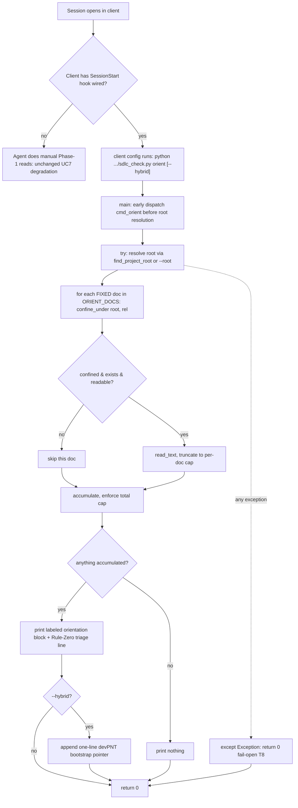

<!-- SHADOW generated from devPNT (e_tdd_consolidation_hook v1.0) - do not edit by hand -->

# E-TDD: Unit 1 — SessionStart Orientation Hook

**Type:** Technical Design
**Milestone:** M4 — Consolidation & Proactive Activation (Unit 1)
**Frames:** milestone_vision_consolidation v2.1 (APPROVED)
**Derived from:** e_isp_consolidation_hook v1.0
**Governed by:** p_tm_consolidation T1/T2/T3/T8/T10 ([MILESTONE] requirements)
**Status:** DRAFT

## Integration & Data Flow

Only one code module changes (`sdlc_check.py`); the other three touched files are prose/wiring.

## Module Change Plan

### File 1 — `skills/agentic-sdlc-skill/scripts/sdlc_check.py` (MODIFY)
- New constants `ORIENT_DOCS` (fixed hard-coded label→relpath set: README, INDEX, reference/INDEX, handoff), `ORIENT_PER_DOC_CHARS=6000`, `ORIENT_MAX_TOTAL_CHARS=16000`.
- New `cmd_orient(args) -> int`: always returns 0 (fail-open, T8); whole body wrapped in `try/except Exception: return 0`. Resolves root via `find_project_root` (or `--root`), iterates `ORIENT_DOCS`, `confine_under` each (T3), skips missing/unreadable/None, truncates per-doc + total (T2), emits a labeled repo-sourced block + Rule-Zero triage line; `--hybrid` appends a devPNT bootstrap pointer (no plan/KL dup). Zero-execution (T1): call graph reaches no subprocess/eval.
- `main()`: new `orient` subparser (`parents=[common, hybrid_opt]`) + early dispatch (`if args.cmd == "orient": return cmd_orient(args)`) beside `gate`, before root resolution.

### File 2 — `skills/agentic-sdlc-skill/scripts/test_session_start.py` (ADD, dev-only)
Stdlib unittest battery: fail-open (missing ai_docs → silent exit 0), all-sections-emitted, partial-skip, total-size-cap, unreadable-skip, zero-execution-side-effect (`$(touch PWNED)` inert), hybrid-pointer-no-dup, no-hybrid-when-off, path-confinement-applied (confine_under spy).

### File 3 — `skills/agentic-sdlc-skill/ENFORCEMENT.md` (MODIFY)
New `## 4. SessionStart hook (orientation, optional)`: intent + per-client wiring (claude `.claude/settings.json`, codex `.codex/hooks.json`, gemini) invoking `sdlc_check.py orient [--hybrid]`; T10 CI-copy caveat.

### File 4 — `skills/agentic-sdlc-skill/SKILL.md` (MODIFY)
One bullet in `### 1. Audit and Alignment`: optional hook automates the orientation reads, degrades to manual, no Python dependency, fail-open.

## State Model
N/A — declared. `orient` is a stateless read→emit with a single terminal exit code (always 0); no lifecycle/status/mode/phase field introduced.

## Developer testing strategy
`test_session_start.py` battery (fail-open, size-cap, zero-execution side-effect, hybrid-no-dup, confinement) + manual smoke (`orient` at repo root, empty dir, `--hybrid`). Full eval battery is Unit 4's scope. Zero-execution verified static (call-graph grep) + dynamic (side-effect test).
