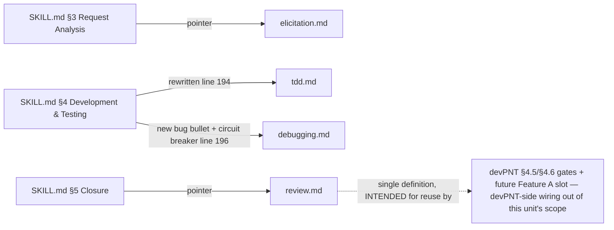

<!-- SHADOW generated from devPNT (e_tdd_execution_disciplines v1.0) - do not edit by hand -->
# E-TDD: Execution Disciplines (Tier-1) — Technical Design

**Milestone:** M2 (M-VISION v1.2 APPROVED) — implements `e_isp_execution_disciplines` v1.0.

## 1. Integration & Data Flow
Four new support files wired into the three workflow phases; each wiring point serves one M-VISION success signal.

Anchor map (P-TM T8 mitigation) — every file has ≥1 inbound pointer:
| File | Anchor in SKILL.md | Success signal |
|---|---|---|
| elicitation.md | §3, new line directly under the "### 3. Request Analysis" heading (before "Standalone L3:") | 3 |
| tdd.md | §4, line 194 rewritten | 1 |
| debugging.md | §4, new bullet after line 194 + line 196 (circuit breaker) augmented | 2 |
| review.md | §5, new bullet after line 201 ("Run the relevant tests/lint/smoke checks.") | 4 |

## 2. Module Change Plan

### 2.1 skills/agentic-sdlc-skill/tdd.md — ADD (~80 lines; ceiling ~90 per M-VISION scope-in)
Skeleton (H2 sections): `Applicability` (L2/L3 implementation work; L1, doc-only and Spike exempt — Spike records outcome note only) → `The loop` (RED: write ONE failing test first, run it, watch it fail — **MUST: no implementation code before the failing test exists; why: a test written after the code passes vacuously and proves nothing** / GREEN: minimum code to pass / REFACTOR: clean up with tests green) → `Increment rule` (one behavior per loop) → `Test shape` (AAA arrange-act-assert for unit tests — the single home of the guidance formerly on SKILL.md line 194) → `When TDD does not apply` (no test harness, pure-doc, spike — **MUST record the explicit reason in the ANALYSIS Diary or Action Plan node; why: an unrecorded exemption is indistinguishable from forgetting**) → `Anti-patterns` (tests-after as unexplained default; testing implementation details; one giant test covering everything).

### 2.2 skills/agentic-sdlc-skill/debugging.md — ADD (~80 lines; ceiling ~90)
Skeleton: `Applicability` (bugs classified L2/L3; entered from phase 4 or from the circuit breaker) → `Method` numbered: 1 reproduce deterministically (smallest input); 2 isolate (minimal failing case; bisect when unclear); 3 root cause — name the MECHANISM (**MUST NOT patch a symptom without naming the mechanism; why: symptom patches recur and stack**); 4 fix at the cause; 5 regression test that FAILS on the old code; 6 run the relevant suite for collateral → `Circuit breaker integration` (after 3 no-progress runs: STOP, audit assumptions, restart from step 1; still stuck → ask the user with the evidence gathered) → `Anti-patterns` (shotgun debugging; stacking speculative fixes; "fixed but can't say why").

### 2.3 skills/agentic-sdlc-skill/elicitation.md — ADD (~70 lines; ceiling ~90)
Skeleton: `Applicability` (L3 entering phase 3, BEFORE drafting ANALYSIS/E-ISP; skip path: spec already complete via approved vision or explicit requirements → one-line note in the analysis) → `The round` (ONE structured set: goal/benefit; scope boundaries; non-goals; constraints — technical, compatibility, security; acceptance signals; short numbered questions, offer options where real) → `Reflect` (fold answers into ANALYSIS §Objective/§Vision-Alignment or D-UC/E-ISP; a second round only when answers open a real fork) → `Anti-patterns` (interrogation — endless question lists; asking what the approved vision already answers; collecting answers without folding them into the document).

### 2.4 skills/agentic-sdlc-skill/review.md — ADD (~75 lines; ceiling ~90)
Skeleton: `Applicability` (closure of L2/L3; any independent review slot — devPNT §4.5/§4.6 realizations, future Feature A review step; single definition, DRY) → `Requesting` (hand the reviewer: scope, the authoritative design artifact — E-TDD/ANALYSIS — and the actual diff; never "review my session"; say which finding classes you want) → `Receiving` (**MUST answer findings one by one — fix, or justify with evidence; why: silent drops turn review into theater**; disagreement stated explicitly, never absorbed by rewording the finding; log the outcome when the project keeps a REVIEW_LOG) → `Reviewing` (verify against the real source, evidence as file:line, severity honest, no praise padding) → `Anti-patterns` (batch-dismissal; rewording instead of addressing; scope-creep findings).

### 2.5 skills/agentic-sdlc-skill/SKILL.md — MODIFY (6 touch points, net +3 lines)
1. §3 (after line 177 heading, before "Standalone L3:"): NEW line: "For any L3, run the spec elicitation round in `elicitation.md` BEFORE drafting the analysis (skip path inside — one-line note when the spec is already complete)."
2. §4 line 194 REWRITE: "- Implementation work follows the TDD discipline in `tdd.md` (RED/GREEN/REFACTOR — the L2/L3 default; record the reason when it does not apply)."
3. §4 line 195: UNCHANGED (no-test-env verification declaration is broader than TDD — stays).
4. §4 NEW bullet after 194: "- For bugs (L2/L3), follow the systematic debugging method in `debugging.md`."
5. §4 line 196 AUGMENT: "- Circuit breaker: after 3 consecutive runs without progress on the tests, stop, switch to the systematic method in `debugging.md`, and ask for instructions if still stuck."
6. §5 NEW bullet after line 201: "- For the review itself follow `review.md` (requesting and receiving findings) — the single definition, intended for reuse by the Hybrid review gates (devPNT-side wiring out of this unit's scope)."
Pointer budget honest count: 3 NEW lines (§3, §4-bugs, §5) + 2 REWRITTEN lines (194, 196). No other SKILL.md text touched.

### 2.6 package.json — MODIFY (this unit: files allowlist only)
After the `guides.md` entry, add 4 lines: `"skills/agentic-sdlc-skill/tdd.md"`, `"skills/agentic-sdlc-skill/debugging.md"`, `"skills/agentic-sdlc-skill/elicitation.md"`, `"skills/agentic-sdlc-skill/review.md"`. `version` untouched (release step, per E-ISP).

### 2.7 README.md — MODIFY
"Installed support files" bullet: extend list with the four files. "Runtime Shape" tree: four new entries after `guides.md`. No other README text.

### 2.8 CHANGELOG.md — MODIFY
New `## [Unreleased - 1.9.0] (M2: execution disciplines Tier-1)` section at top: Added — four discipline support files + their SKILL.md wiring (one line each). Heading dated at release step.

### 2.9 gemini-extension.json — declared, NOT designed here
Release-step lockstep bump only (E-ISP row); no content in this unit.

## 3. State Model
N/A — no lifecycle/status/mode/phase FIELD is touched (SKILL.md phase headings unchanged; no data model exists). Declared per E-TDD schema.

## 4. Developer Testing Strategy (battery — acceptance for the implementer)
1. `npm pack --dry-run --json` → the 4 new files present in the tarball (T5).
2. Inbound-pointer check (T8): grep SKILL.md for each of `tdd.md|debugging.md|elicitation.md|review.md` → each ≥1 hit at its §-anchor.
3. Line budget (T2): each new file ≤ ~90 lines per the M-VISION scope-in (`wc -l`; 91-92 tolerated only with a stated reason, never silently).
4. MUST audit (T1): every MUST/MUST NOT in the 4 files carries an adjacent "why:" clause — grep and eyeball.
5. Model-name leak (T7): grep the 4 files for provider model names (Opus, Sonnet, Haiku, Gemini, GPT, Codex-as-model) → 0 hits in normative text.
6. `templates.md` untouched: `git diff --name-only` does not list it.
7. init.js smoke on scratch project → CLEAN (no needle change proves lib.js parsing intact).
8. `sdlc_check.py check --hybrid --root <repo>` → CLEAN.
9. SKILL.md diff audit: exactly the 6 touch points of §2.5, nothing else (`git diff skills/agentic-sdlc-skill/SKILL.md`).

## 5. Implementation dispatch plan
Single implementer task (one coherent diff), economy tier (client-relative, per ADR 2026-07-02), self-contained brief: this E-TDD via its exported shadow + file paths + battery §4 as acceptance. No session history. Independent code review at deep tier on the diff vs this E-TDD (§4.6) before M2.A4 closes. Escalation: two review FAILs on the same task → re-dispatch at deep tier.
