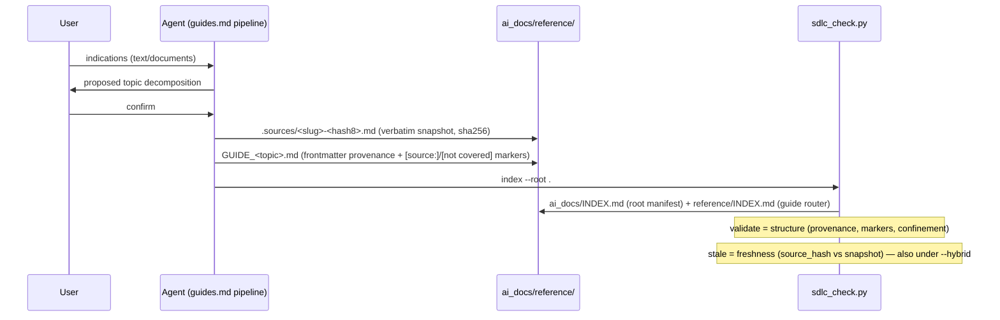

<!-- SHADOW generated from devPNT (e_tdd_operative_guides_u1 v1.2) - do not edit by hand -->
# E-TDD: Operative Guides — Unit 1 (project-scope guides)

**Type:** Technical Design Document
**Milestone:** M1 — Feature B
**Upstream:** e_isp_operative_guides_u1 v1.0 (accepted), p_tm_operative_guides v1.0 (accepted)
**Lodestar:** milestone_vision_operative_guides (accepted; v1.1 aligns status line)

## 1. Integration & Data Flow

Two flows: guide GENERATION (pipeline, prose-driven) and guide VERIFICATION (validator, mechanical).



Reader flow (UC-2): a context-free subagent receives the guide PATH in its brief → reads GUIDE_<topic>.md → operates per it. No MCP, no session history.

## 2. Module Change Plan

### 2.1 `skills/agentic-sdlc-skill/scripts/sdlc_check.py` — MODIFY

**New module-level constants (near GENERATED_DOCS, ~line 50):**
```python
GUIDE_INDEX_HEADER = ("<!-- GENERATED by sdlc_check.py index - do not edit by hand. "
                      "Source of truth: the headers of the GUIDE_*.md files in ai_docs/reference/. -->")
GUIDE_PROVENANCE_KEYS = ("source", "distilled_from", "source_hash")  # source_version optional
# a guide section is "covered" when it carries a source marker or an explicit gap marker
GUIDE_MARKER_RE = re.compile(r"\[(?:source:[^\]]+|not covered by source)\]")
```

**`list_canonical_docs(root)` — MODIFY (dot-dir filter; fixes the round-1 BLOCK):**
```python
for p in sorted(base.rglob("*.md")):
    rel_parts = p.relative_to(base).parts
    if any(part.startswith(".") for part in rel_parts[:-1]):
        continue  # dot-subdirs (e.g. reference/.sources/) are never canonical
    if p.name in GENERATED_DOCS or p.name == "README.md":
        continue
```
- Called by: `build_manifest`, `cmd_index`, `cmd_validate` (manifest alignment + lifecycle loop). No signature change → zero caller impact.

**`sha256_file(path)` — ADD (utility, near read_text):**
```python
def sha256_file(path):
    import hashlib
    h = hashlib.sha256()
    h.update(path.read_bytes())
    return h.hexdigest()
```
(`import hashlib` moves to the top-level imports; shown inline here only for locality.)

**`list_guides(root)` — ADD (single authoritative guide enumerator):**
```python
def list_guides(root):
    """[(rel_to_ai_docs, path, meta, text)] for ai_docs/reference/GUIDE_*.md."""
    ref = root / "ai_docs" / "reference"
    out = []
    if not ref.is_dir():
        return out
    for p in sorted(ref.glob("GUIDE_*.md")):
        text = read_text(p)
        out.append((p.relative_to(root / "ai_docs").as_posix(), p,
                    load_frontmatter(text.splitlines()), text))
    return out
```
- Consumed by: `build_guide_index`, `cmd_validate` guide checks, `cmd_stale` guide-freshness. DRY: one enumerator, three consumers.
- Note: top-level `GUIDE_*.md` only (no rglob) — subdirs of reference/ are not part of the unit-1 contract.

**`build_guide_index(root)` — ADD (the generated guide router):**
```python
def build_guide_index(root):
    lines = [GUIDE_INDEX_HEADER,
             "# Operative guides (generated router)",
             "",
             "One row per guide. `description` is the when-to-consult line; provenance",
             "shows what the guide was distilled from. Freshness: run `sdlc_check.py stale`.",
             "",
             "| Guide | Status | When to consult | Source | Source version |",
             "|---|---|---|---|---|"]
    for rel, p, meta, _ in list_guides(root):
        lines.append("| `{}` | {} | {} | {} | {} |".format(
            p.name, meta.get("status", "-") or "-",
            (meta.get("description", "") or "-").replace("|", "\\|"),
            (meta.get("source", "") or "-").replace("|", "\\|"),
            meta.get("source_version", "") or "-"))
    return "\n".join(lines) + "\n"
```
- Role split vs root manifest rendered in the header text (E-ISP design decision 2).

**`cmd_index(root)` — MODIFY (emit the guide router):**
After the existing root-manifest block, add:
```python
    guides = list_guides(root)
    gidx = root / "ai_docs" / "reference" / "INDEX.md"
    if guides:
        gidx.write_text(build_guide_index(root), encoding="utf-8")
        print(f"[ok] guide router regenerated: {gidx}")
    elif gidx.is_file():
        print(f"[warn]  {gidx} exists but no GUIDE_*.md found: stale router, remove or add guides")
```
- No-empty-manifest policy preserved. `reference/INDEX.md` basename is already in `GENERATED_DOCS` → never swept as canonical (verified in E-ISP as-is).

**`cmd_validate(root, strict=False)` — MODIFY (guide structure checks, new block after the canonical-lifecycle loop):**
```python
    # Guide checks (ai_docs/reference/GUIDE_*.md): structure only — freshness is stale's job
    guides = list_guides(root)
    for rel, p, meta, text in guides:
        missing = [k for k in GUIDE_PROVENANCE_KEYS if not meta.get(k)]
        if missing:
            warnings.append(f"{rel}: guide missing provenance key(s): {', '.join(missing)}")
        # (b) per-section fidelity markers: every '## ' section body must carry a marker
        body = text.split("---", 2)[-1]
        sections = re.split(r"^##\s+", body, flags=re.M)[1:]
        unmarked = [s.splitlines()[0].strip() for s in sections if not GUIDE_MARKER_RE.search(s)]
        if unmarked:
            warnings.append(f"{rel}: section(s) without [source: ...] / [not covered by source] marker: "
                            + "; ".join(unmarked[:5]))
        # (c) distilled_from confinement — fail closed (P-TM T6, distilled_from vector)
        df = meta.get("distilled_from", "")
        if df:
            if Path(df).is_absolute() or ".." in Path(df).parts:
                errors.append(f"{rel}: distilled_from '{df}' is absolute or escapes the project (..): rejected")
            else:
                target = (root / df).resolve()
                try:
                    target.relative_to(root.resolve())
                except ValueError:
                    errors.append(f"{rel}: distilled_from '{df}' resolves outside the project root: rejected")
    # guide-router alignment (mirror of the root-manifest check)
    gidx = root / "ai_docs" / "reference" / "INDEX.md"
    if guides:
        if not gidx.is_file():
            errors.append("ai_docs/reference/INDEX.md missing: run 'sdlc_check.py index'")
        elif norm_text(read_text(gidx)) != norm_text(build_guide_index(root)):
            errors.append("ai_docs/reference/INDEX.md not aligned with the guides: run 'sdlc_check.py index'")
```
- Severities per E-ISP: provenance/markers = warn — under `--strict` the RUN's overall exit code fails if any warning is present (the existing blanket mechanism at the end of cmd_validate; there is NO per-warning error-escalation and none must be invented); confinement + router misalignment = error.
- The `.resolve()` call also neutralizes symlink escapes (resolves to the real path before the containment test).

**`cmd_stale(root, hybrid=False)` — MODIFY (guide freshness; the one-freshness-motor home):**
Restructure: guide-drift check runs ALWAYS (also `--hybrid`); only the audit-plan part is hybrid-skipped. CONTROL-FLOW NOTE (review round-1 BLOCK): the existing audit-plan body has THREE early returns (`return 0` when no rows, `return 0` when nothing stale, `return 1` when stale — current lines 525/557/566); the first two MUST become `return rc`, otherwise a drifted guide is silently discarded on those paths. The rewritten function, with the audit-plan tail shown explicitly:
```python
def cmd_stale(root, hybrid=False):
    rc = 0
    # --- guide freshness (source_hash vs snapshot) — runs in EVERY mode
    drifted = []
    for rel, p, meta, _ in list_guides(root):
        df, rec = meta.get("distilled_from", ""), meta.get("source_hash", "")
        if not df or not rec:
            continue  # structure problems are validate's job
        src = root / df
        if not src.is_file():
            print(f"[warn]  {rel}: distilled_from '{df}' not found — snapshot missing")
            rc = 1
            continue
        if sha256_file(src) != rec:
            drifted.append((rel, df))
    for rel, df in drifted:
        print(f"[stale] {rel}: source snapshot '{df}' changed since distillation — regenerate the guide")
    if drifted:
        rc = 1
    # --- audit-plan staleness — delegated to devPNT/KL in hybrid
    if hybrid:
        print("[info] hybrid mode: audit-plan staleness is delegated to devPNT/KL, skipping.")
        return rc                                  # was: implicit skip-all; guide rc survives
    f, _, rows = parse_audit_plan(root)
    if not rows:
        print(f"[info] no rows in {f}: nothing to check "
              "(audit not initialized, or Hybrid mode where mapping is delegated to devPNT).")
        return rc                                  # was: return 0 — MUST carry guide rc
    use_git = git_available(root)
    stale = []
    # ... (existing per-row loop UNCHANGED: lines 526-553 of the current file) ...
    if not stale:
        print("[ok] no analyzed area was modified after its last recorded analysis.")
        return rc                                  # was: return 0 — MUST carry guide rc
    # ... (existing stale-listing prints UNCHANGED: lines 558-565) ...
    return 1                                       # stale areas dominate: rc already implied
```
- Behavior change vs today: `stale --hybrid` no longer unconditionally returns 0 — documented in SKILL.md coexistence (E-ISP blast radius). `cmd_check` consumes the rc unchanged (`rc_s` OR-ed with validate's).

### 2.2 `skills/agentic-sdlc-skill/templates.md` — MODIFY

New section after the canonical-header section, heading exactly `## ai_docs/reference/GUIDE_[topic].md` (non-colliding with init needles, argued in E-ISP):

````markdown
## ai_docs/reference/GUIDE_[topic].md

Operative guide distilled from USER-PROVIDED indications (never from model knowledge).
The verbatim source snapshot lives in `ai_docs/reference/.sources/<slug>-<hash8>.md`;
`source_hash` is the snapshot's SHA-256. Every `##` section carries a fidelity marker:
`[source: <snapshot-file>#<anchor-or-line>]` for covered content, or a literal
`[not covered by source]` for gaps. Sections are CHOSEN from the repertoire below —
only those the source actually supports; never force empty ones.

```markdown
---
description: One line, ≤160 chars — when to consult this guide.
status: CURRENT
source: Human-readable name of what the user provided.
source_version: v1.2          # optional — only when the origin is versioned
distilled_from: ai_docs/reference/.sources/topic-a1b2c3d4.md
source_hash: <sha256 of the snapshot file>
---
# Guide: [Topic]

## How to do [X]
[source: topic-a1b2c3d4.md#setup]
<!-- operative steps, imperative voice -->

## How to verify it is done right
[source: topic-a1b2c3d4.md#checks]

## What NOT to do
[not covered by source]
<!-- the user's material does not address this: do not invent. -->
```

Section repertoire (pick what the source supports): How to do X / How to verify /
What NOT to do / What to watch out for / Core principles / When this applies.
```` 

### 2.3 `skills/agentic-sdlc-skill/guides.md` — ADD (support file, prose)

Structure (~90 lines):
1. **When to trigger**: the user hands indications to follow ("do it this way", a doc to adhere to) — origin+purpose test, no content taxonomy (lodestar Non-Goal).
2. **Pipeline**: decompose into topics → user confirms → snapshot each source verbatim into `.sources/<slug>-<hash8>.md` (slug from topic, hash8 = first 8 hex of the snapshot's sha256) → source-anchored extraction → render per template → `sdlc_check.py index`.
3. **Fidelity rules** (the D5 constraint, imperative): only what the source supports; gaps marked, never filled; markers per section; `summarize-and-expand` forbidden.
4. **Ingestion bound (T9)**: source > ~2000 lines → ask the user to split or select; never silently truncate.
5. **Review**: recommend independent guide-vs-source review before first use (process control per P-TM).
6. **Maintenance**: source changed → new snapshot + regenerate guide + old one `SUPERSEDED` if replaced; `stale` flags hash drift.

### 2.4 `skills/agentic-sdlc-skill/SKILL.md` — MODIFY

- Support-file list: add `guides.md` line.
- New short section "Operative Guides" (~12 lines) after "ai_docs documents": trigger test (origin = user, purpose = govern the agent), fidelity constraint one-liner, pointer to `guides.md`, note that `reference/INDEX.md` is generated.
- Closure bullet: guides created/changed ⇒ `index` regenerates BOTH manifests.
- Coexistence section, "Validator in Hybrid": update `stale --hybrid` wording (guide-drift still runs; only audit-plan staleness is skipped).

## 3. State Model

Guides reuse the canonical lifecycle (no new state machine). Freshness is an orthogonal, computed dimension:

| Current state | Event/trigger | Guard | Next state | Side effect |
|---|---|---|---|---|
| CURRENT + fresh | source snapshot changes (hash mismatch) | source_hash recorded | CURRENT + **stale** (computed by `stale`, not stored) | `stale` exit 1, message "regenerate" |
| CURRENT + stale | pipeline regenerates guide from new snapshot | user confirms topics | CURRENT + fresh (new source_hash) | new snapshot in `.sources/`, `index` rerun |
| CURRENT | guide replaced by a new guide | new guide declares `supersedes:` | SUPERSEDED | validator warns if old stays CURRENT (existing check) |
| any | `distilled_from` missing on disk | — | unchanged | `stale` warn "snapshot missing", exit 1 |
| DRAFT | user validates content | explicit confirmation | CURRENT | — |
| SUPERSEDED | any edit attempt | — | rejected (convention: dead doc) | — |

Scoping note: `DEPRECATED` is inherited unchanged from the generic canonical lifecycle (recognized, no guide-specific logic branches on it) — deliberately out of this unit's new code paths.

## 4. Security requirements implemented (P-TM traceability)
- T1: provenance + marker presence → validate (a)(b). T2: hash drift → stale. T6 (distilled_from vector): confinement with `.resolve()` containment, absolute/`..` rejected, ERROR fail-closed → validate (c). T8: snapshot + source_hash binding → template + stale. T9: ingestion bound → guides.md §4 (prose).

## 5. Developer Testing Strategy
Scenario battery (extends the existing scratch-project harness):
1. Valid guide (provenance + markers + good hash) → validate 0 errors; `index` emits both manifests; re-validate clean.
2. Guide missing `source_hash` → warn; `--strict` → exit 1.
3. Section without marker → warn naming the section.
4. `distilled_from: ../outside.md` and absolute path → ERROR, exit 1.
5. Snapshot edited after distillation → `stale` exit 1 with [stale] line; ALSO with `--hybrid`.
6. `.sources/*.md` present → NOT in root manifest, NOT lifecycle-warned.
7. No guides → validator output byte-identical to pre-change (regression); `stale --hybrid` prints only the delegation info.
8. Router drift (hand-edited reference/INDEX.md) → validate ERROR.
9. init.js smoke: template extraction still resolves all 6 needles after templates.md addition.

## 6. Implementation dispatch plan (model-per-dispatch, client-agnostic)
Single implementer task (one coherent diff), dispatched to an **economy-tier** subagent — the client's mid/fast model, whatever the client is (Claude Code, Gemini/Antigravity, Codex, ...). Tiers are CLIENT-RELATIVE capability levels, never provider model names: `economy` = the client's mid/fast tier (sufficient because the granular §2 design turns implementation into transcription, not invention); `deep` = the strongest model the client offers (used for review). The tier→model binding lives outside governed artifacts — in the client's agent definitions or session configuration; dated illustrative examples may live in the skill's support files, marked as examples. Execution records (REVIEW_LOG `model` column, diaries) log the CONCRETE model actually used.

Brief: self-contained — this E-TDD §2 (via its exported shadow path) + file paths + test battery §5 as acceptance; no session history.
Review: independent code review at **deep tier** on the diff vs this E-TDD (devPNT §4.6 realization ladder: native subagent → fresh one-shot client run → declared self-pass).
Escalation: after two review FAILs on the same task, re-dispatch at deep tier (roadmap 4.2 decision).
