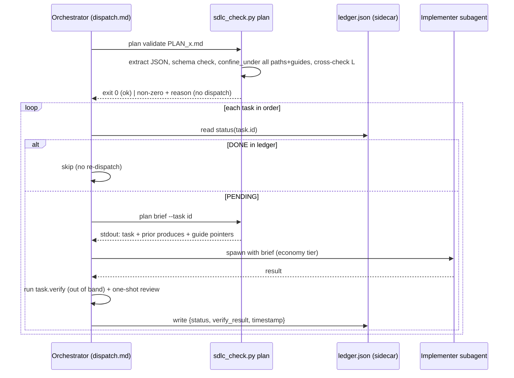

<!-- SHADOW generated from devPNT (e_tdd_subagent_execution v1.0) - do not edit by hand -->
# E-TDD: Subagent Execution (Feature A)

**Type:** Technical Design
**Milestone:** M3 — Subagent Execution
**Derived-from:** e_isp_subagent_execution v1.0 (ACCEPTED); frames milestone_vision_subagent_execution v1.1
**Status:** DRAFT

## Integration & Data Flow
The validator gains a `plan` command; the orchestrator (per `dispatch.md`) drives the loop. The validator is zero-execution — it validates and emits text only; the orchestrator does the spawning and running.


Degradation: no subagent tool → orchestrator runs each task same-session, same plan/ledger/one-shot-review (no capability loss).

## Module Change Plan

### `skills/agentic-sdlc-skill/scripts/sdlc_check.py` (MODIFY)
- **`confine_under(base: Path, rel: str) -> Path | None`** (NEW helper, near `require_ai_docs`). Fail-closed: return `None` if `rel` is absolute or any part is `..`; else wrap BOTH resolves and the check in one guard — `try: t = (base / rel).resolve(); t.relative_to(base.resolve()); return t except (ValueError, OSError): return None`. Catching `(ValueError, OSError)` (not `ValueError` only) and keeping the `.resolve()` calls INSIDE the try is required to preserve site 1's behavior below — an OSError at resolve was already a fail-closed rejection there and must not become a crash. Single source for path confinement.
- **Refactor two existing sites to call it** (behavior-preserving — the extraction must reproduce each site exactly):
  - `check_kb_collisions` `overrides:` block (lines ~407-421): today it does `try: (kb_ref/ov).resolve(); ...relative_to(kb_ref.resolve()) except (ValueError, OSError): <fail-closed error>; continue`, plus a separate "target not found" warning. Replace with `confine_under(kb_ref, ov)`; `None` → the existing "escapes/absolute → rejected (fail closed)" error + continue (covers BOTH the ValueError and OSError paths); non-None but not existing on disk → the existing "target not found" warning. The `(ValueError, OSError)` guard in `confine_under` is what makes this exact.
  - `cmd_validate` `distilled_from` block (lines ~573-583): today catches only `ValueError`. Replace inline with `confine_under(root, df)`; `None` → existing "resolves outside the project root: rejected" error. Widening to also catch OSError here is a strict superset (an OSError becomes the same fail-closed rejection) — no behavior lost.
- **`PLAN_TASK_REQUIRED = ("id", "title", "verify")`** + rule "at least one of `paths`/`produces`" (module constant).
- **`extract_plan_json(text: str) -> tuple[dict | None, str]`** (NEW). Regex the first ```json fenced block (`re.search(r"```json\n(.*?)```", text, re.DOTALL)`); guarded `json.loads`; return `(data, "")` or `(None, reason)`. Fail-fast, never raises.
- **`load_ledger(path: Path) -> tuple[dict, str]`** (NEW). If absent → `({}, "")`. Else guarded `json.loads`; malformed/oversized → `({}, reason)`. Never raises, never hangs.
- **`cmd_plan(args) -> int`** (NEW). Zero-execution — imports/calls no `subprocess`/`git_*`/`os.system`/`eval`. Branch on `args.plan_cmd`:
  - `validate`: read plan file; `extract_plan_json`; on `None` → stderr reason, return 2. For each task: assert `PLAN_TASK_REQUIRED` present + paths-or-produces; `confine_under(root, p)` for every `paths`/`consumes`/`produces` (→ None = reject, return 2); for each `guides` entry `g`, `if confine_under(ref_dir, g) is None and confine_under(kb_ref, g) is None: reject` (where `ref_dir = root/"ai_docs"/"reference"` and `kb_ref = DEFAULT_KB_ROOT/"ai_docs"/"reference"`, both existing symbols) — a guide under neither root is rejected. Assert task ids unique. `load_ledger`; any ledger id not in plan → warning (stderr), not fatal. All good → return 0.
  - `brief`: read+validate (reuse the same path), find task by `--task`; if unknown id → stderr, return 2. Print to **stdout only**: the task block, the `produces` of all prior-order tasks (interfaces), and the `guides` pointers (paths, not content). The `verify` string is printed verbatim as text, never executed.
- **`main()` (lines 811-854)**: add `pp = sub.add_parser("plan", parents=[common], ...)`; `pp_sub = pp.add_subparsers(dest="plan_cmd", required=True)`; `pv = pp_sub.add_parser("validate"); pv.add_argument("file")`; `pb = pp_sub.add_parser("brief"); pb.add_argument("file"); pb.add_argument("--task", required=True)`. Dispatch: `if args.cmd == "plan": return cmd_plan(args)` (after the `root` resolution line, since `cmd_plan` needs `root`). Purely additive to the six existing commands.

### `skills/agentic-sdlc-skill/templates.md` (MODIFY)
Add `## ai_docs/solutions/PLAN_[feature].md` section: a fenced markdown block = frontmatter (`status`, `derived-from: e_tdd_<key> vX.Y`) + a fenced ```json `{ "tasks": [ {id,title,paths,consumes,produces,verify,guides} ] }` with one worked example task; below it a short note describing the sidecar `PLAN_[feature].ledger.json` shape `{ "<task_id>": {"status","verify_result","timestamp"} }`. New heading → no needle collision.

### `skills/agentic-sdlc-skill/dispatch.md` (ADD)
Doctrine (≤~80 lines): opt-in trigger (L3 only); the loop above; model-per-dispatch = client-relative tiers (economy implementer, deep on escalation after two FAILs — no provider names, ADR 2026-07-02); one-shot review slots (inline self-review + one reviewer + one broad final, NO iterative loops); ledger read/skip/write protocol; degradation rule; guides injected by pointer (paths from `plan brief`), never pasted. Hybrid: plan `derived-from` the accepted E-TDD; per-task review reuses the devPNT reviewers.

### `skills/agentic-sdlc-skill/SKILL.md` (MODIFY)
Under `### 4. Development and Testing` (line 192): add an opt-in bullet — for an L3 with an approved design, the orchestrator MAY execute via subagents per `dispatch.md`, gated by `sdlc_check.py plan validate` ("no valid plan, no dispatch"); default stays same-session. One Hybrid line: the executable plan is `derived-from` the accepted E-TDD, never independently authored.

### `README.md` (MODIFY)
Add `dispatch.md` to the "Installed support files" prose (line 11) and the file-tree (lines 44-54), peer of `tdd.md`/`review.md`.

### `package.json` (MODIFY)
Add `"skills/agentic-sdlc-skill/dispatch.md"` to `files` (before the `scripts` entry). Version bump deferred to release (GUIDE_release owns the triple bump).

### Release-owned files — `gemini-extension.json` + `CHANGELOG.md` (E-ISP rows, deferred)
Explicitly NOT modified in this implementation unit. Both are part of the release triple-bump (package.json + gemini-extension.json + CHANGELOG.md) owned by `GUIDE_release` at release time — the same split accepted for M2/Feature-B units. Closing the two E-ISP MODIFY rows as intentional release-time deferrals, not silent drops.

### `skills/agentic-sdlc-skill/scripts/test_plan.py` (ADD)
Stdlib `unittest`, no deps. Cases: valid plan → rc0; missing `verify` → rc2; missing paths&produces → rc2; `paths` with `../escape` → rc2; `guides` outside reference/KB → rc2; duplicate ids → rc2; malformed plan JSON → rc2; malformed ledger JSON → rc2 (or clean skip per load_ledger); ledger id not in plan → rc0 + warning on stderr; `brief` emits the verify string to stdout WITHOUT executing (assert no side effect / assert text present); `confine_under` unit cases (abs, `..`, ok, escape). Plus regression: `validate`/`check` on this repo's own ai_docs stays green after the refactor.

## State Model — ledger task lifecycle (required: touches task status)
State = the ledger entry for a task id. `verify_result` ∈ {pass, fail}.

| Current state | Event / trigger | Guard | Next state | Side effect |
|---|---|---|---|---|
| PENDING (no ledger entry) | orchestrator dispatches, verify passes | `verify_result==pass` | DONE | ledger entry written; task never re-dispatched |
| PENDING | orchestrator dispatches, verify fails | `verify_result==fail` | PENDING (fail recorded) | re-dispatch allowed; escalate to deep tier after 2 fails (dispatch.md) |
| DONE | resume / new session reads ledger | task id ∈ plan | DONE | skipped, not re-dispatched (survives compaction) |
| DONE | `plan validate` | task id ∉ plan (removed/renamed) | ORPHAN | validator warning (ledger id not in plan); not fatal |
| PENDING/DONE | `plan validate` schema pass | — | unchanged | validation is read-only; never mutates the ledger |
| DONE | attempt re-dispatch | — | REJECTED (illegal) | ledger-skip prevents re-running an applied, possibly mutating task |
| entry present, `status` ∉ {done} or missing/corrupt (parses OK, distinct from T5 whole-file) | orchestrator reads status(id) | status value not the DONE sentinel | treated as PENDING | fail-safe re-dispatch, never skipped-as-done (unknown status defaults toward doing the work, not skipping it) |

Status-domain guard: only the exact DONE sentinel skips a task; every other value (including a missing `status` key on a present entry) falls to PENDING. This makes a corrupt ledger fail toward re-execution, never toward silent under-execution.

The validator only ever READS the ledger (cross-check + brief); the orchestrator is the sole writer. Zero-execution and single-writer are the two invariants that keep this safe.

## Security requirements (from P-TM, implemented here)
T1 zero-execution: `cmd_plan` call graph reaches no spawn call (test asserts brief emits verify text unexecuted). T2/T3: `confine_under` on all task paths + guide pointers, fail-closed. T4: ledger cross-check + `verify_result` recorded, validator read-only. T5: `extract_plan_json` + `load_ledger` fail-fast on both surfaces. T6: `derived-from` presence warned in Hybrid (dispatch.md doctrine + plan frontmatter).
