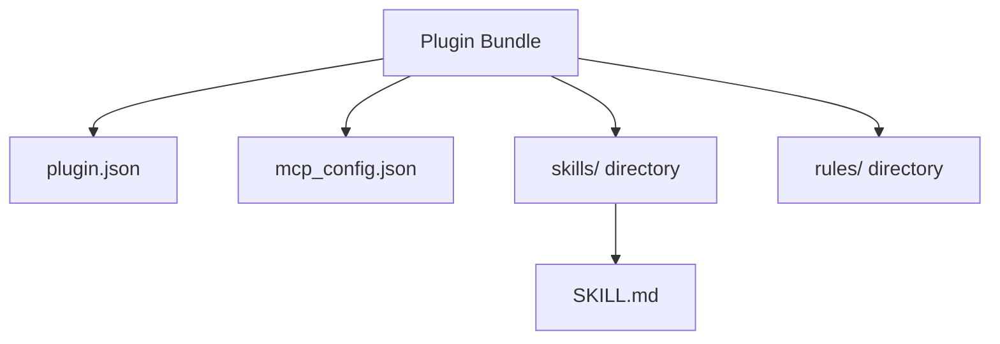

# Guide: Creating Skills and MCP Integration in Antigravity 2.0

This guide explains the authoritative architecture and conventions for creating **Agent Skills** and integrating **Model Context Protocol (MCP)** servers in the **Antigravity 2.0** environment.

---

## 1. Core Architecture: Plugins vs. Skills vs. MCP

In Antigravity 2.0, capabilities are organized into modular, namespaced bundles called **Plugins**:



*   **Plugin:** The container package holding manifest definitions, rules, hooks, and skills.
*   **Skill (`SKILL.md`):** High-level playbooks and instructions guiding how the AI coordinates tools.
*   **MCP Server (`mcp_config.json`):** Low-level execution tools (APIs, databases, system access) mapped to the Model Context Protocol.

---

## 2. Directory Layout and Autodiscovery

Antigravity 2.0 searches for plugins in two main scopes:

### A. Global Scope (Recommended for System Tools)
Placed in the user's global configuration directory:
*   **Windows:** `C:\Users\<Username>\.gemini\config\plugins\<plugin-name>\`
*   **macOS/Linux:** `~/.gemini/config/plugins/<plugin-name>/`

### B. Workspace Scope (Project-Specific)
Placed directly at the root of the active workspace:
*   `<project-root>/.agents/plugins/<plugin-name>/`
*   `<project-root>/_agents/plugins/<plugin-name>/`

### Autodiscovered Folder Structure
To be recognized automatically, your plugin must adhere to the following structure:

```text
C:\Users\<Username>\.gemini\config\plugins\<plugin-name>\
├── plugin.json                 # Required: Plugin metadata
├── mcp_config.json             # Optional: MCP tool definitions (auto-registered)
├── hooks.json                  # Optional: Hook event bindings
├── skills/                     # Optional: Agent skills
│   └── <skill-name>/
│       └── SKILL.md            # Markdown instructions for the skill
└── rules/                      # Optional: Constraints and system-prompt additions
    └── constraints.md
```

---

## 3. Defining the Plugin Manifest (`plugin.json`)

The `plugin.json` manifest defines the plugin's metadata. A typical example:

```json
{
  "name": "agentic-sdlc-skill",
  "version": "1.0.0",
  "description": "Documentation-First Software Development Lifecycle (SDLC) skill for Antigravity 2.0",
  "author": "Antonio Pinto",
  "dependencies": []
}
```

---

## 4. Automatic MCP Recognition

Antigravity 2.0 enables plugins to define their own MCP servers directly within the plugin package. When the plugin is loaded, its defined MCP servers are **automatically recognized** and registered.

### Decoupling from local paths via SSE (Server-Sent Events)
To avoid hardcoding local paths (such as `D:\SoftwareDev\devPNT\...`) and prevent the agent from needing to "spy" on the server's source code, you should configure the MCP server to run via **SSE (HTTP)**. 

In Antigravity 2.0, remote/SSE MCP servers are registered using the `"serverUrl"` key (instead of `"url"`):

#### Plugin-level `mcp_config.json` for SSE:
```json
{
  "mcpServers": {
    "devpnt": {
      "serverUrl": "http://127.0.0.1:8000/sse",
      "headers": {
        "Authorization": "Bearer <token-if-needed>"
      }
    }
  }
}
```

This ensures that the agent connects to the running devpnt server purely via HTTP/SSE endpoints without needing local file-system access to the devPNT source files.

---

## 5. Structuring Skill Instructions (`SKILL.md`)

The `SKILL.md` file (located under `skills/<skill-name>/SKILL.md`) provides the high-level playbook for the agent. It should contain:
1.  **Role & Goal:** What the skill enables the agent to do.
2.  **Workflow States:** The sequence of steps the agent must take.
3.  **Command Mapping:** Guidance on when to call the specific MCP tools.

Example `SKILL.md` skeleton:
```markdown
# Agentic SDLC Skill Playbook

## Role
You are an expert engineer coordinating the SDLC process using the devPNT MCP.

## Setup Handshake
Before calling strategic tools, always verify the active Master Plan status by invoking `devpnt_mcp_get_bootstrap`.

## Core Guidelines
- Always propose changes in docs/ before changing code.
- Align low-level task lists in task.md with approved action plans.
```

---

## 6. Automating Installation with `setup_mcp.bat`

To ensure automatic recognition of both the skills and the MCP server upon installation, you can write a `setup_mcp.bat` script that orchestrates the deployment:

```batch
@echo off
SETLOCAL EnableDelayedExpansion

:: 1. Define target paths
SET "GLOBAL_PLUGINS_DIR=%USERPROFILE%\.gemini\config\plugins\agentic-sdlc-skill"
SET "SOURCE_SKILL_DIR=%~dp0"

echo [Setup] Initializing Agentic SDLC Skill for Antigravity 2.0...

:: 2. Create the target directory structure
if not exist "%GLOBAL_PLUGINS_DIR%\skills\agentic-sdlc" (
    mkdir "%GLOBAL_PLUGINS_DIR%\skills\agentic-sdlc"
)

:: 3. Copy files to the global plugins folder
copy /Y "%SOURCE_SKILL_DIR%plugin.json" "%GLOBAL_PLUGINS_DIR%\plugin.json" >nul
copy /Y "%SOURCE_SKILL_DIR%mcp_config.json" "%GLOBAL_PLUGINS_DIR%\mcp_config.json" >nul
copy /Y "%SOURCE_SKILL_DIR%skills\agentic-sdlc\SKILL.md" "%GLOBAL_PLUGINS_DIR%\skills\agentic-sdlc\SKILL.md" >nul

echo [Setup] Copy complete. Global plugin files deployed.

:: 4. Start the SSE local server in the background (if packaged)
:: start /B python sse_server.py

echo [Setup] Configuration completed successfully. Restart Antigravity 2.0 to load.
pause
```
